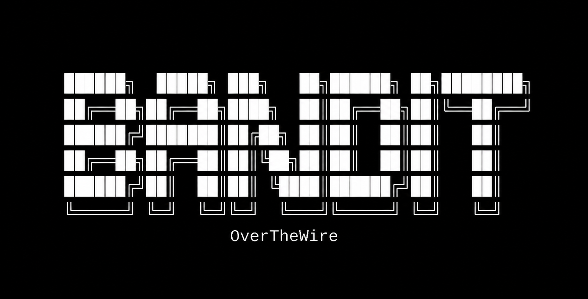

<div align="center">



# OverTheWire — Bandit

**Wargame de Linux y fundamentos de seguridad**


[](https://git.io/typing-svg)

[Writeups](levels/) · [OverTheWire](https://overthewire.org/wargames/bandit/)

</div>

---

## 🧩 Sobre el proyecto

[OverTheWire Bandit](https://overthewire.org/wargames/bandit/) es un wargame orientado al aprendizaje práctico de **Linux, línea de comandos y fundamentos de seguridad**.

Este repositorio documenta la resolución de los **33 niveles**, desde la conexión inicial mediante SSH hasta desafíos relacionados con networking, enumeración, shell, Git y entornos restringidos.

Cada writeup registra el proceso utilizado para resolver el desafío, incluyendo los comandos empleados, el análisis realizado y los conceptos involucrados.

> El objetivo no es únicamente obtener la contraseña del siguiente nivel, sino comprender **por qué funciona la solución**.

---


## 📊 Progreso

```text
Plataforma   : OverTheWire
Wargame      : Bandit
Niveles      : 33 / 33
Estado       : Finalizado
Writeups     : 33
Entorno      : Linux

Progreso
[████████████████████████████████████████] 100%
```


---

## 🖥️ Áreas trabajadas

| Área                  | Contenido                                              |
| --------------------- | ------------------------------------------------------ |
| 🖥️ **Linux**         | Sistema de archivos, permisos, procesos y shell        |
| 🌐 **Networking**     | SSH, Netcat, Nmap y SSL/TLS                            |
| 🔎 **Enumeración**    | Archivos, puertos, servicios e información del sistema |
| 📂 **Análisis**       | `grep`, `strings`, `file`, `diff`, `xxd`               |
| 🔐 **Encoding**       | Base64, ROT13 y transformación de datos                |
| ⚙️ **Automatización** | Scripts y fuerza bruta controlada                      |
| 🔓 **Privilegios**    | SUID y entornos restringidos                           |
| 🌿 **Git**            | Commits, historial, tags y referencias                 |

---

## 🧭 Niveles completados

La siguiente tabla permite recorrer los niveles de forma secuencial. Cada entrada enlaza directamente con su writeup.

|   Nivel   | Tema                           | Técnica / Herramienta  |          Writeup          |
| :-------: | ------------------------------ | ---------------------- | :-----------------------: |
| `00 → 01` | 🔑 Conexión inicial            | `ssh`                  | [Ver](levels/level-00.md) |
| `01 → 02` | 📂 Archivo especial            | `cat`                  | [Ver](levels/level-01.md) |
| `02 → 03` | 📂 Nombres con espacios        | `cat`                  | [Ver](levels/level-02.md) |
| `03 → 04` | 📂 Archivos ocultos            | `ls`                   | [Ver](levels/level-03.md) |
| `04 → 05` | 🔎 Identificación de archivos  | `file`                 | [Ver](levels/level-04.md) |
| `05 → 06` | 🔎 Enumeración                 | `find`                 | [Ver](levels/level-05.md) |
| `06 → 07` | 🔎 Búsqueda avanzada           | `find`                 | [Ver](levels/level-06.md) |
| `07 → 08` | 📄 Filtrado de texto           | `grep`                 | [Ver](levels/level-07.md) |
| `08 → 09` | 📄 Líneas únicas               | `sort` / `uniq`        | [Ver](levels/level-08.md) |
| `09 → 10` | 🔬 Análisis de binarios        | `strings`              | [Ver](levels/level-09.md) |
| `10 → 11` | 🔐 Codificación                | `base64`               | [Ver](levels/level-10.md) |
| `11 → 12` | 🔐 Transformación              | `tr` / ROT13           | [Ver](levels/level-11.md) |
| `12 → 13` | 📦 Compresión                  | `xxd` / `gzip` / `tar` | [Ver](levels/level-12.md) |
| `13 → 14` | 🔑 Autenticación               | SSH Private Key        | [Ver](levels/level-13.md) |
| `14 → 15` | 🌐 Networking                  | `nc`                   | [Ver](levels/level-14.md) |
| `15 → 16` | 🔐 SSL/TLS                     | `openssl`              | [Ver](levels/level-15.md) |
| `16 → 17` | 🔎 Enumeración de puertos      | `nmap`                 | [Ver](levels/level-16.md) |
| `17 → 18` | 📄 Comparación de archivos     | `diff`                 | [Ver](levels/level-17.md) |
| `18 → 19` | 🖥️ Shell restringida          | Shell                  | [Ver](levels/level-18.md) |
| `19 → 20` | 🔓 Privilegios                 | SUID                   | [Ver](levels/level-19.md) |
| `20 → 21` | 🌐 Comunicación entre procesos | `nc`                   | [Ver](levels/level-20.md) |
| `21 → 22` | ⚙️ Tareas programadas          | `cron`                 | [Ver](levels/level-21.md) |
| `22 → 23` | ⚙️ Scripts automatizados       | `cron`                 | [Ver](levels/level-22.md) |
| `23 → 24` | ⚙️ Manipulación de scripts     | `cron`                 | [Ver](levels/level-23.md) |
| `24 → 25` | 🔐 Fuerza bruta                | Automatización         | [Ver](levels/level-24.md) |
| `25 → 26` | 🖥️ Shell restringida          | Shell                  | [Ver](levels/level-25.md) |
| `26 → 27` | 🖥️ Evasión de restricciones   | Shell escape           | [Ver](levels/level-26.md) |
| `27 → 28` | 🌿 Repositorio                 | Git                    | [Ver](levels/level-27.md) |
| `28 → 29` | 🌿 Historial                   | Git                    | [Ver](levels/level-28.md) |
| `29 → 30` | 🌿 Recuperación de información | Git                    | [Ver](levels/level-29.md) |
| `30 → 31` | 🌿 Tags y referencias          | Git                    | [Ver](levels/level-30.md) |
| `31 → 32` | 🌿 Repositorio remoto          | Git                    | [Ver](levels/level-31.md) |
| `32 → 33` | 🖥️ Shell restringida          | Shell escape           | [Ver](levels/level-32.md) |

---

## 📂 Estructura del repositorio

```text
Bandit/
│
├── levels/
│   ├── level-00.md
│   ├── level-01.md
│   ├── level-02.md
│   ├── ...
│   └── level-32.md
│
├── image.png
└── README.md
```

> [!IMPORTANT]
> Cada archivo dentro de `levels/` corresponde a un nivel del wargame.

---

## 📚 Cómo utilizar los writeups

> [!TIP]
> Si estás realizando Bandit por tu cuenta, intenta resolver cada nivel antes de consultar la documentación. Utiliza los writeups como material de apoyo para revisar el proceso, comparar métodos y reforzar lo aprendido.

Los writeups permiten:

- Repasar comandos de Linux.
- Comprender técnicas de enumeración.
- Comparar diferentes métodos de resolución.
- Revisar herramientas utilizadas en CTF.
- Reforzar conceptos de networking y shell.
---

## 🔒 Seguridad y ética

> [!WARNING]
> Este repositorio tiene fines exclusivamente educativos. Todos los ejercicios documentados fueron realizados dentro del entorno autorizado de **OverTheWire Bandit**.
>
> Las técnicas descritas aquí no deben utilizarse contra sistemas sin autorización explícita.

---

<div align="center">

[](https://git.io/typing-svg)

<br>

<a href="#overthewire--bandit">
  <kbd>⬆ Volver al inicio</kbd>
</a>

</div>
